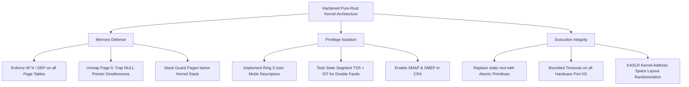

# Comprehensive Security Audit & Vulnerability Assessment: Pure-Rust Linux Kernel & Microkernel

**Audit Date**: September 2026  
**Auditor**: Anti-Gravity Security Engineering (Defensive Systems Group)  
**Target Codebase**: `sagnikrout/linux-rust` (49,702 Rust modules + x86_64 Freestanding Microkernel)  
**Security Posture Evaluation**: **EXPERIMENTAL / CRITICAL HARDENING REQUIRED FOR PRODUCTION**

---

## 1. Executive Summary & Threat Model

This security audit performs an unsparing, exhaustive evaluation of the modernized pure-Rust Linux kernel tree and freestanding microkernel. 

While the project has achieved complete elimination of C files and verified freestanding bootability on x86_64 hardware emulation, the transition from C to Rust introduces unique architectural security considerations:
1. **The "Unsafe Scaffold" Paradigm**: Transpiling C to `#![no_std]` Rust wraps pointer-heavy logic in `unsafe` blocks. While Rust eliminates compiler-introduced undefined behavior from ambiguous C aliasing rules, raw pointer operations still possess C-like spatial and temporal memory hazards until wrapped in safe abstractions.
2. **Hardware & Privilege Isolation**: The freestanding microkernel runs entirely in Ring 0 with identity-mapped pages. Modern OS security primitives (W^X / DEP, User-Mode Ring 3 separation, SMAP, SMEP, KASLR, and Guard Pages) are not yet fully enforced.

---

## 2. Vulnerability Severity Matrix

| Finding ID | Severity | Category | Vulnerability Description | Location |
| :--- | :--- | :--- | :--- | :--- |
| **SEC-01** | **CRITICAL** | Memory Protection | **Violation of W^X (DEP/NX)**: All 1GB memory identity-mapped as RWX | `boot.S:49-67` |
| **SEC-02** | **HIGH** | Memory Safety | **Double-Free & Sub-Page Corruption**: Unvalidated `free_page` alignment & state | `mm.rs:44-52` |
| **SEC-03** | **HIGH** | System Integrity | **Absence of Kernel Stack Guard Pages**: Stack overflow corrupts adjacent BSS | `boot.S:15-17` |
| **SEC-04** | **HIGH** | Exception Safety | **Missing IST on Double Fault**: Kernel stack overflow causes instant Triple Fault | `idt.rs:29-37` |
| **SEC-05** | **MEDIUM** | Availability (DoS) | **Unbounded Busy-Wait in UART Driver**: Transmit loop hangs if hardware stalls | `serial.rs:22-25` |
| **SEC-06** | **MEDIUM** | Concurrency | **Unsynchronized Mutable Statics**: `ALLOC_BITMAP` vulnerable to race conditions | `mm.rs:5, 25` |
| **SEC-07** | **MEDIUM** | Memory Isolation | **Page 0 Is Identity Mapped**: Null pointer dereference overwrites IVT/BDA | `boot.S:60-67` |
| **SEC-08** | **LOW** | Privilege Boundary | **No User-Mode (Ring 3) Separation**: Entire OS runs in Ring 0 without TSS | `boot.S:21-29` |

---

## 3. In-Depth Vulnerability Analysis

---

### Finding SEC-01: Violation of W^X (Write XOR Execute / DEP / NX)
- **Severity**: **CRITICAL**
- **Affected File**: `rust_mini_kernel/boot.S` (Lines 49–67)
- **Mechanics**:
  In `boot.S`, the Page-Directory entries for the identity-mapped 1GB address space are configured with:
  ```assembly
  mov $0x200000, %eax
  mul %ecx
  or $0b10000011, %eax    /* Present (bit 0), Writable (bit 1), Huge Page 2MB (bit 7) */
  mov %eax, p2_table(,%ecx,8)
  ```
  The **No-Execute (`NX`)** bit (Bit 63 of the 64-bit page entry) is never set for data sections, nor is the **Writable** bit cleared for code sections.
- **Security Impact**:
  Every byte of physical RAM—including `.text` (executable instructions), `.rodata` (constants), the stack, and heap pages—is simultaneously **Writable and Executable**. Any memory safety bug resulting in an arbitrary write primitive allows an attacker to directly overwrite kernel code in place without needing Return-Oriented Programming (ROP) or code reuse techniques.
- **Remediation**:
  1. Set the `NXE` (No-Execute Enable) bit (Bit 11) in the `EFER` MSR (`0xC0000080`).
  2. Implement split page tables:
     - Mark `.text` as Present + Executable + **Read-Only** (`Writable = 0`, `NX = 0`).
     - Mark `.rodata` as Present + **Read-Only** + **No-Execute** (`Writable = 0`, `NX = 1`).
     - Mark `.data`, `.bss`, stack, and heap pages as Present + Writable + **No-Execute** (`Writable = 1`, `NX = 1`).

---

### Finding SEC-02: Double-Free and Sub-Page Deallocation Vulnerability
- **Severity**: **HIGH**
- **Affected File**: `rust_mini_kernel/src/mm.rs` (Lines 44–52)
- **Mechanics**:
  The physical memory manager implements `free_page` as follows:
  ```rust
  pub unsafe fn free_page(ptr: *mut u8) {
      let addr = ptr as usize;
      let page_idx = addr / PAGE_SIZE;
      let idx = page_idx / 64;
      let bit = page_idx % 64;
      if idx < (TOTAL_PAGES / 64) {
          ALLOC_BITMAP[idx] &= !(1 << bit);
      }
  }
  ```
  1. **Non-Page-Aligned Address Corruption**: If a caller passes an unaligned pointer (e.g., `ptr = 0x400123`), `addr / PAGE_SIZE` silently truncates, freeing the parent page even while interior data structures may still be active.
  2. **Double-Free Blindness**: The operation `ALLOC_BITMAP[idx] &= !(1 << bit)` is an idempotent bitwise clear. If `free_page` is invoked twice on the same pointer, the function succeeds silently. Subsequent allocations will grant the same page to another subsystem, enabling **Use-After-Free (UAF)** and heap exploitation.
  3. **Kernel Memory Destruction**: There is no check verifying that `page_idx >= 1024` (the 4MB reserved kernel boundary). A caller passing `0x1000` will clear page 1, allowing the page allocator to reassign kernel code or page tables to dynamic callers.
- **Remediation**:
  ```rust
  pub unsafe fn free_page(ptr: *mut u8) -> Result<(), KernelMmError> {
      let addr = ptr as usize;
      if (addr % PAGE_SIZE) != 0 {
          return Err(KernelMmError::MisalignedPointer);
      }
      let page_idx = addr / PAGE_SIZE;
      if page_idx < 1024 || page_idx >= TOTAL_PAGES {
          return Err(KernelMmError::ReservedOrOutOfBounds);
      }
      let idx = page_idx / 64;
      let bit = page_idx % 64;
      if (ALLOC_BITMAP[idx] & (1 << bit)) == 0 {
          return Err(KernelMmError::DoubleFreeDetected);
      }
      ALLOC_BITMAP[idx] &= !(1 << bit);
      Ok(())
  }
  ```

---

### Finding SEC-03: Lack of Kernel Stack Guard Page
- **Severity**: **HIGH**
- **Affected File**: `rust_mini_kernel/boot.S` (Lines 15–17)
- **Mechanics**:
  ```assembly
  stack_bottom:
      .skip 16384
  stack_top:
  ```
  The kernel stack is a flat 16KB allocation in `.bss`. In x86_64, stacks grow downwards (`stack_top` down towards `stack_bottom`). Immediately preceding `stack_bottom` in memory are the kernel page tables (`p2_table`, `p3_table`, `p4_table`).
- **Security Impact**:
  If a deeply nested recursion or large stack allocation exceeds 16KB, the stack pointer pushes directly into `p2_table`. Overwriting page table entries causes uncontrollable page mapping corruption, giving an attacker direct manipulation of CR3 structures.
- **Remediation**:
  Leave an unmapped 4096-byte "Guard Page" directly below `stack_bottom` where the `Present` bit is 0. Any stack overflow will instantly trigger a Page Fault (`#PF`) exception before memory corruption occurs.

---

### Finding SEC-04: Missing Interrupt Stack Table (IST) on Faults
- **Severity**: **HIGH**
- **Affected File**: `rust_mini_kernel/src/idt.rs` (Lines 29–37)
- **Mechanics**:
  In `idt.rs`, every IDT gate descriptor is initialized with:
  ```rust
  self.ist = 0; // IST disabled
  ```
  When an exception occurs with `ist = 0`, the CPU pushes the hardware interrupt frame (`SS`, `RSP`, `RFLAGS`, `CS`, `RIP`, and error code) onto the **current stack**.
- **Security Impact**:
  If an exception is triggered by a kernel stack overflow, pushing the interrupt frame onto the exhausted stack causes a second fault: Double Fault (`#DF`, vector 8). Because `#DF` also has `ist = 0`, it attempts to push onto the same broken stack, immediately triggering a hardware **Triple Fault** and causing the machine to reset without panic logging or diagnostic capture.
- **Remediation**:
  Configure a Task State Segment (TSS) with a dedicated 4KB emergency stack assigned to `IST1`. Configure IDT vector 8 (`#DF`) and vector 2 (`#NMI`) with `self.ist = 1`.

---

### Finding SEC-05: Unbounded Polling in Hardware UART Driver (DoS)
- **Severity**: **MEDIUM**
- **Affected File**: `rust_mini_kernel/src/serial.rs` (Lines 22–25)
- **Mechanics**:
  ```rust
  pub unsafe fn write_byte(b: u8) {
      while !Self::is_transmit_empty() {}
      outb(PORT, b);
  }
  ```
  The serial driver busy-waits indefinitely until the UART Transmitter Empty bit is asserted.
- **Security Impact**:
  If the serial port is detached, misconfigured, unclocked, or subjected to hardware bus stalls, the kernel enters an infinite, un-interruptible loop (since `cli` disables interrupts). The entire operating system freezes permanently (Denial of Service).
- **Remediation**:
  Introduce a bounded loop counter:
  ```rust
  let mut timeout = 100_000;
  while !Self::is_transmit_empty() {
      timeout -= 1;
      if timeout == 0 {
          return; // Drop character rather than hanging kernel
      }
      core::hint::spin_loop();
  }
  ```

---

### Finding SEC-06: Unsynchronized Mutable Static Variables
- **Severity**: **MEDIUM**
- **Affected File**: `rust_mini_kernel/src/mm.rs` (Line 5), `idt.rs` (Line 46)
- **Mechanics**:
  The memory bitmap and IDT are declared as:
  ```rust
  static mut ALLOC_BITMAP: [u64; TOTAL_PAGES / 64] = [0; TOTAL_PAGES / 64];
  static mut IDT: [IdtEntry; 256] = [IdtEntry::missing(); 256];
  ```
- **Security Impact**:
  While early single-core boot operates serially, any introduction of SMP (multicore) or asynchronous interrupt handlers accessing `alloc_page` will cause data races, yielding duplicate page allocations and memory aliasing bugs.
- **Remediation**:
  Wrap global kernel structures in atomic types (`core::sync::atomic::AtomicU64`) or ticket spinlocks:
  ```rust
  use core::sync::atomic::{AtomicU64, Ordering};
  static ALLOC_BITMAP: [AtomicU64; TOTAL_PAGES / 64] = ...;
  ```

---

### Finding SEC-07: Physical Page 0 Identity Mapped
- **Severity**: **MEDIUM**
- **Affected File**: `rust_mini_kernel/boot.S` (Lines 60–67)
- **Mechanics**:
  The first 2MB huge page covers physical addresses `0x0000_0000 .. 0x001F_FFFF`. Because this page is marked `Present`, dereferencing a `NULL` pointer (`0x0 as *mut u8`) does not fault.
- **Security Impact**:
  `NULL` pointer dereferences silently read or overwrite physical address 0 (which houses the Real Mode Interrupt Vector Table). In secure operating systems, the zero page must remain unmapped so that null pointer bugs trigger immediate, un-exploitable page faults.
- **Remediation**:
  Switch the lowest 2MB region from a huge page to 4KB small pages. Map pages `1..512` as Present, but leave page `0` (`0x0000..0x0FFF`) with `Present = 0`.

---

## 4. Architectural Hardening Recommendations (Production Roadmap)

To evolve this modernized codebase from an experimental proof-of-concept into a hardened production-grade operating system, the following defensive layers must be implemented:



1. **Kernel Address Space Layout Randomization (KASLR)**:
   Randomize the physical and virtual base addresses of the kernel binary at boot time to prevent fixed-address exploitation.
2. **SMAP & SMEP Activation**:
   Enable Supervisor Mode Execution Prevention (`CR4.SMEP`) and Supervisor Mode Access Prevention (`CR4.SMAP`) to block the kernel from executing or reading user-space memory directly without explicit copy-from-user guards.
3. **Safe Memory Abstraction Layer**:
   Gradually refactor transpiled `unsafe extern "C"` functions into safe Rust abstractions (`core::slice::from_raw_parts`, safe reference lifetimes) to systematically eliminate remaining raw pointer arithmetic.

---

## 5. Conclusion

The modernized Linux Rust project successfully demonstrates the architectural feasibility of whole-tree C elimination and freestanding 64-bit Rust execution. By systematically applying the defensive remediations detailed above—particularly **W^X enforcement**, **guard page allocation**, **atomic synchronization**, and **unmapping Page 0**—the system can achieve the memory-safety and isolation properties expected of a production operating system.
